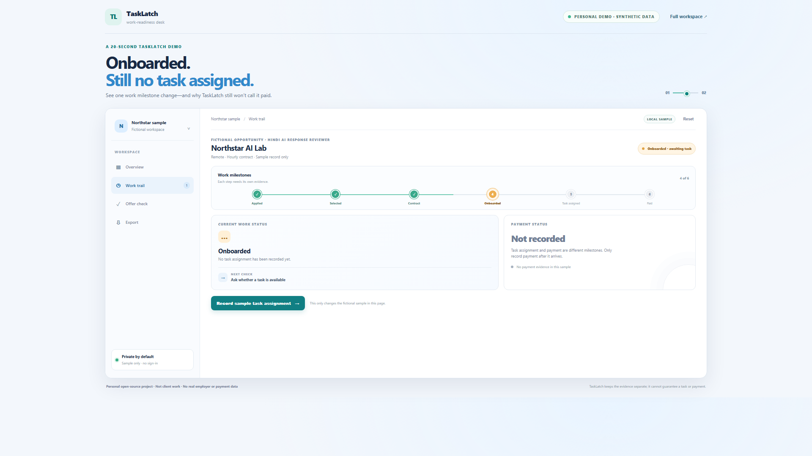
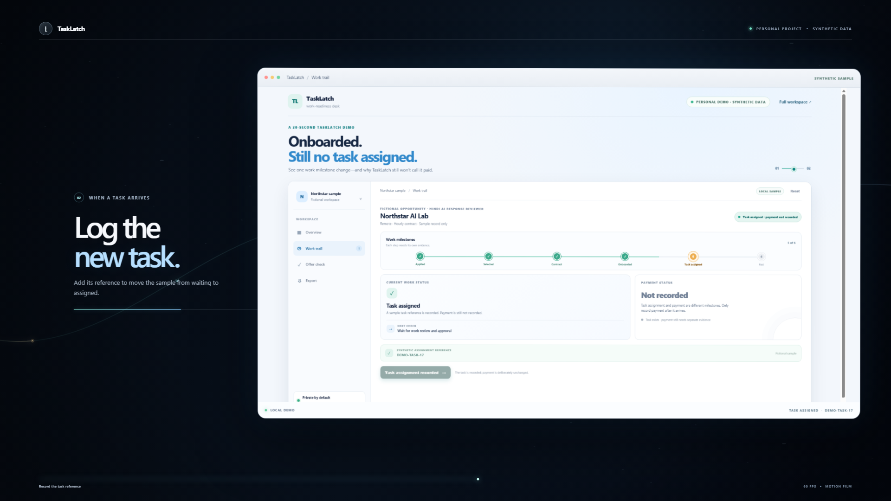

# TaskLatch — from “selected” to the first paid task

**A contract can be signed while the task queue is still empty.** TaskLatch helps independent workers keep selection, contract, assignment, delivery, approval, and payment separate—with a small warning checklist for risky money requests.

**Personal open-source project · Fictional sample records · Synthetic data · Not client work**

## Live demo

Open the [TaskLatch demo](https://shivam9864op.github.io/tasklatch-work-readiness/). It runs in the browser with fictional sample records. No sign-in is needed.

## Watch the video

[Watch the real 60-second walkthrough](media/tasklatch-walkthrough.mp4) · [Read the English captions](media/tasklatch-walkthrough.en.vtt)

## Focused product demo

[Open the interactive one-feature demo](quick-demo.html) · [Watch the 20-second video](media/tasklatch-quick-demo.mp4) · [Read its captions](media/tasklatch-quick-demo.en.vtt)

The quick demo focuses on one distinction: onboarding is not a task assignment, and assignment is not payment. Its HTML, CSS, state logic, tests, and video-recording script are included in this repository. The cover below is a direct screenshot of the working demo, not a generated product screen.



## Motion-design product film

[Watch the 20-second TaskLatch motion film (60 fps)](media/tasklatch-motion-promo.mp4) · [Open the HTML motion storyboard](motion-promo.html) · [Read the English captions](media/tasklatch-motion-promo.en.vtt)

The film follows one idea rather than listing every feature: onboarding is not assignment, and assignment is not payment. Motion continues through the full 20 seconds: paired light runners trace the milestone path, the camera drifts gently, fine arcs move behind the real product screen, and status cards breathe subtly. The camera then pushes into the working product, records a sample assignment in the real demo, and carries the 3D screen move into the close. Payment remains unrecorded. It is captured at 60 fps directly from the rendered animation, with no generated in-between frames. All names and records are fictional. The film is a personal motion concept, not client work.



**Personal open-source demo · Fictional sample records · Synthetic data · Not client work**

## What it does

- Keeps the work timeline explicit: **saved → source checked → applied → assessment → selected → contract → onboarded → task assigned → submitted → approved → paid**.
- Calls out the gap between selection/onboarding and an actual task assignment. Expected pay is not counted as received pay.
- Checks offers for requests to pay an upfront fee, deposit, crypto, or money to unlock tasks or withdrawals. It says **pause and verify**—not “this company is definitely a scam.”
- Compares the rate in a listing with the rate you recorded from written terms. Missing values remain unknown, not zero.
- Keeps a short evidence trail using non-sensitive references, such as an application ID or task ID. It does not accept private contract or identity documents.
- Provides a redacted JSON backup. Notes are omitted, reference IDs are shortened, and URL paths are removed by default.

## Try the synthetic sample

1. Open **Overview**. Northstar AI Lab is marked onboarded, but there is no assigned task in its record.
2. Open **Offer check** and choose QuickTask Rewards. The sample asks for money to unlock tasks, so TaskLatch says to pause and verify.
3. Open **Work trail**, choose Northstar AI Lab, and add a fictional task reference. The status changes to task recorded; payment is still not assumed.
4. Open **Export & privacy** to inspect the redacted backup preview.

Reset sample restores the fictional examples. Other records are stored only in the current browser profile.

## Why this exists

Public discussion suggests two useful problems to explore: job seekers describe ghosting and scattered follow-ups, while other workers describe the confusing distance between selection/onboarding and a real assignment. These are qualitative signals, not a representative study or proof of demand. See [research notes](docs/research-and-limits.md).

Existing job trackers already handle application lists, status history, reminders, and email updates. TaskLatch focuses on the later work-readiness boundary: a selection or onboarding message is not itself an assigned task, and an assigned task is not itself payment. It does not claim that no similar tool exists.

## Run locally

Requires Node.js 20 or later. No packages or build step are needed.

```powershell
node --test
node scripts/verify-project.mjs
node scripts/serve.mjs
```

Open the local address printed by the server (default: `http://127.0.0.1:8782/`). The development server binds to loopback, accepts only GET/HEAD requests, denies image loads, and never serves hidden files or directories.

To record the walkthrough on Windows, install Microsoft Edge and FFmpeg from their official sources, then run:

```powershell
node scripts/record-walkthrough.mjs
```

The recording script uses a separate temporary browser profile, captures frames of the working local demo, encodes a subtitled MP4, and removes its temporary frames and profile. It never touches a signed-in browser session.

Run node scripts/record-quick-demo.mjs to reproduce the short product clip, English captions, and cover screenshot from the working local demo. Run node scripts/record-motion-promo.mjs to capture the 20-second film directly at 60 fps and export a 1920×1080 MP4; the recorder also verifies the product-state transitions.

## Privacy and limitations

- Records stay in browser storage unless the user explicitly downloads a backup. Import is size-limited and validated before it replaces current records.
- There is no Gmail access, scraping, platform login, external AI, analytics, or automatic message sending.
- The checklist cannot prove that a role or employer is legitimate. Users must check official company and platform sources independently.
- “Pause and verify” is a caution, not a legal finding. The tool is not legal, tax, employment, or financial advice.
- The app cannot guarantee an assignment, income, a payment date, or a job. Only mark money as paid after you record that you received it.
- All included rates, people, companies, and event references are fictional.

## Tests

The test suite covers milestone prerequisites, payment recording, red-flag states, rate differences, redaction, malformed or oversized imports, and the guided-demo state transition. The project verifier checks the demo source, bundled cover, video player, and absence of app image loads or external fonts.

## Feedback

If you try the demo, feedback on these three questions would help:

1. Is “selected / onboarded / task assigned / approved / paid” clear enough?
2. Which missing checkpoint would make the work trail more useful?
3. Does the offer checklist raise useful questions without implying a false guarantee?

Please do not post private job messages, contracts, government IDs, or payment information in a public issue.

## License

MIT. See [LICENSE](LICENSE).
